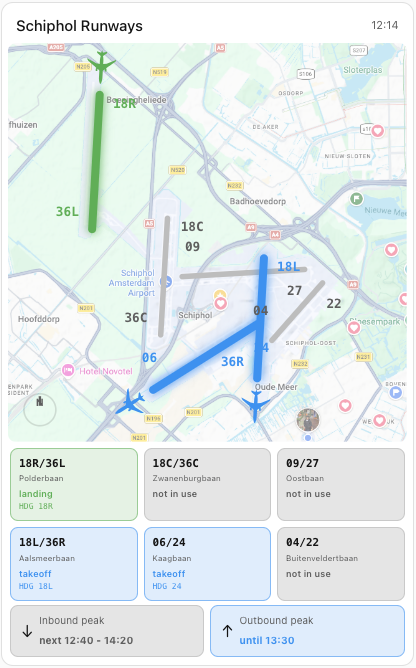

# Schiphol Runway Card

[![HACS Custom][hacs-badge]][hacs-url]
[![GitHub Release][release-badge]][release-url]
[![License: MIT][license-badge]][license-url]

A Home Assistant **Lovelace custom card** that displays a live SVG map of all six Amsterdam Airport Schiphol (EHAM) runways, color-coded by their current status, with airplane sprites showing approach/departure direction and inbound/outbound peak indicators.

> ⚠️ **Requires** the companion **[Schiphol Runway Monitor](https://github.com/archofthings/ha-schiphol-runway-monitor)** integration to be installed and configured first — it provides the sensors this card displays.



---

## Features

- **Accurate SVG runway map** — all six runways drawn with real LVNL geometry
- **Live color coding** — each runway colors automatically as its sensor changes
- **Airplane sprites** — a plane appears at the active end of each runway, pointing in the direction of traffic (green for landings, blue for departures)
- **Runway chips** — a compact status grid below the map; click any chip to open the sensor's more-info dialog
- **Peak indicators** — inbound/outbound peak badges showing `until HH:MM` while active or `next HH:MM - HH:MM` when idle
- **Theme-aware** — follows your Home Assistant light/dark theme automatically
- **HA color palette** — choose runway colors from the native Home Assistant color picker
- **Optional satellite background** — overlay the map on your own aerial image
- **Visual editor** — full GUI configuration, no YAML required

---

## Installation

### Via HACS (Recommended)

1. Open **HACS -> Frontend**
2. Click the menu -> **Custom repositories**
3. Add this repository URL, category **Dashboard**
4. Search for **Schiphol Runway Card** -> **Download**
5. **Hard refresh** your browser (Ctrl/Cmd + Shift + R)

HACS registers the dashboard resource automatically — no manual resource step needed.

### Manual Installation

1. Download `schiphol-runway-card.js` from the latest release
2. Copy it to `/config/www/schiphol-runway-card.js`
3. Add it as a resource: **Settings -> Dashboards -> menu -> Resources -> Add Resource**
   ```
   URL:  /local/schiphol-runway-card.js
   Type: JavaScript module
   ```
4. **Hard refresh** your browser

---

## Usage

Add a card to any dashboard. In the visual editor choose **Schiphol Runway Card**, or add it manually:

```yaml
type: custom:schiphol-runway-card
```

That's it — with no further configuration the card auto-detects the default entity IDs created by the integration.

---

## Configuration

All options are available through the visual editor and have sensible defaults, so you only set what you want to change.

| Option | Type | Default | Description |
|--------|------|---------|-------------|
| `title` | string | `Schiphol Runways` | Card header title |
| `background_image` | string | _(none)_ | URL/path of a background image, e.g. `/local/schiphol/schiphol_sat.png` |
| `background_opacity` | number | `0.55` | Opacity of the background image (0-1) |
| `inbound_color` | HA color | `green` | Color for landing runways/planes |
| `outbound_color` | HA color | `blue` | Color for departing runways/planes |
| `both_color` | HA color | `amber` | Color when a runway is used for both |
| `entities` | map | _(auto)_ | Override the sensor entity for each runway (see below) |

### Full YAML example

```yaml
type: custom:schiphol-runway-card
title: Schiphol Runways
background_image: /local/schiphol/schiphol_sat.png
background_opacity: 0.5
inbound_color: green
outbound_color: blue
both_color: amber
entities:
  18r_36l_polderbaan: sensor.schiphol_airport_eham_18r_36l_polderbaan
  18c_36c_zwanenburgbaan: sensor.schiphol_airport_eham_18c_36c_zwanenburgbaan
  09_27_oostbaan: sensor.schiphol_airport_eham_09_27_oostbaan
  18l_36r_aalsmeerbaan: sensor.schiphol_airport_eham_18l_36r_aalsmeerbaan
  06_24_kaagbaan: sensor.schiphol_airport_eham_06_24_kaagbaan
  04_22_buitenveldertbaan: sensor.schiphol_airport_eham_04_22_buitenveldertbaan
```

The `entities` keys are fixed runway identifiers; map each to whatever sensor entity ID your integration created. If omitted, the card falls back to the default `sensor.schiphol_airport_eham_<key>` IDs.

### Peak entities (optional overrides)

| Option | Default |
|--------|---------|
| `inbound_peak_entity` | `binary_sensor.schiphol_airport_eham_inbound_peak` |
| `outbound_peak_entity` | `binary_sensor.schiphol_airport_eham_outbound_peak` |
| `peak_entity` | `sensor.schiphol_airport_eham_peak_time` |

---

## Color legend

| Color | Meaning |
|-------|---------|
| Grey | Runway not in use |
| Green (default) | Inbound — landings |
| Blue (default) | Outbound — takeoffs |
| Amber (default) | Both landings and takeoffs |

Colors are chosen from the Home Assistant palette and adapt to your theme. Active runways glow, show their heading (e.g. `HDG 27`), and display an airplane pointing in the direction of traffic.

---

## Satellite background

The card can render your runway overlay on top of an aerial/satellite image:

1. Save a satellite screenshot of Schiphol (north-up, roughly square, framing all runways) to `/config/www/`, e.g. `schiphol_sat.png`.
2. In the card editor set **Background image URL** to `/local/schiphol_sat.png` and adjust opacity.

> The runway geometry follows the LVNL schematic, which is close to but not a pixel-perfect geographic projection. Crop your image so Polderbaan sits upper-left and Oostbaan runs along the bottom for the best alignment.

---

## Requirements

| Requirement | Details |
|-------------|---------|
| Home Assistant | 2024.1+ |
| Integration | [Schiphol Runway Monitor][integration-url] installed and configured |

The card reads these entities (created by the integration):

| Entity | Purpose |
|--------|---------|
| `sensor.schiphol_airport_eham_18r_36l_polderbaan` | Runway state |
| `sensor.schiphol_airport_eham_18c_36c_zwanenburgbaan` | Runway state |
| `sensor.schiphol_airport_eham_09_27_oostbaan` | Runway state |
| `sensor.schiphol_airport_eham_18l_36r_aalsmeerbaan` | Runway state |
| `sensor.schiphol_airport_eham_06_24_kaagbaan` | Runway state |
| `sensor.schiphol_airport_eham_04_22_buitenveldertbaan` | Runway state |
| `sensor.schiphol_airport_eham_peak_time` | Peak status |
| `binary_sensor.schiphol_airport_eham_inbound_peak` | Inbound peak boolean |
| `binary_sensor.schiphol_airport_eham_outbound_peak` | Outbound peak boolean |

If your entity IDs differ, override them via the `entities` map in the card config.

---

## Troubleshooting

**"Custom element doesn't exist: schiphol-runway-card"**
- Hard refresh the browser (Ctrl/Cmd + Shift + R)
- Confirm the resource URL matches the file name exactly (hyphens vs underscores)
- Check the browser console for the startup banner; if absent, the resource isn't loading

**Card shows but no colors / no data**
- Confirm the integration is installed and its entities exist (**Developer Tools -> States**, search `schiphol`)
- If your entity IDs differ from the defaults, set them via the `entities` map

**Runways don't line up with the satellite image**
- The LVNL geometry is schematic, not a true geographic projection — crop/scale your image to match (see Satellite background above)

---

## License

MIT — see [LICENSE](LICENSE).

Runway geometry and airplane sprite derived from publicly available LVNL visualizations. Data sourced from [LVNL](https://www.lvnl.nl/) via [dutchplanespotters.nl](https://www.dutchplanespotters.nl/). Not affiliated with LVNL or Amsterdam Airport Schiphol.

[hacs-badge]: https://img.shields.io/badge/HACS-Custom-41BDF5.svg
[hacs-url]: https://hacs.xyz
[release-badge]: https://img.shields.io/github/v/release/archofthings/ha-schiphol-runway-card
[release-url]: https://github.com/archofthings/ha-schiphol-runway-card/releases
[license-badge]: https://img.shields.io/badge/License-MIT-yellow.svg
[license-url]: https://github.com/archofthings/ha-schiphol-runway-card/blob/main/LICENSE
[integration-url]: https://github.com/archofthings/ha-schiphol-runway-monitor
